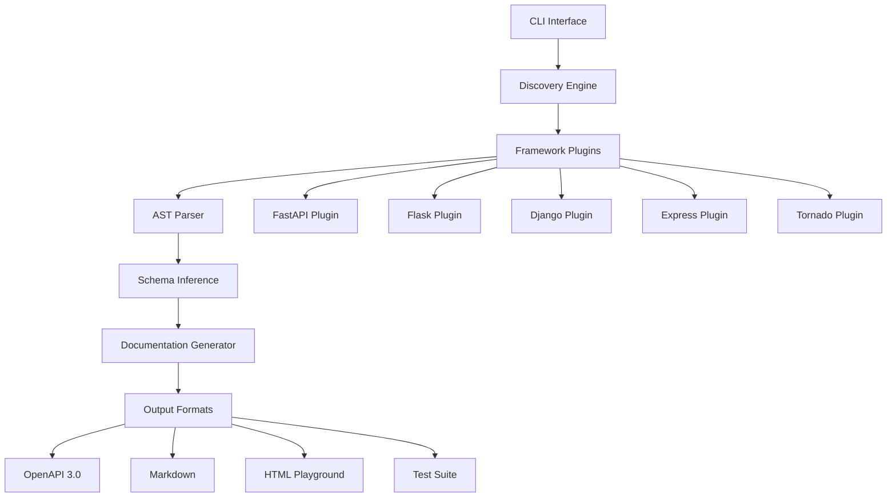

# Architecture Overview

## System Design

The OpenAPI Doc Generator is a modular Python tool that automatically discovers and documents web framework routes.

### Core Components

### Data Flow

1. **Input Processing**: CLI receives application file path and configuration
2. **Framework Detection**: Automatic detection of web framework type
3. **Route Discovery**: Plugin-based extraction of route definitions
4. **Schema Analysis**: AST parsing for type inference and documentation
5. **Documentation Generation**: Output generation in requested formats
6. **Validation**: OpenAPI spec validation and improvement suggestions

### Component Architecture

#### Discovery Engine
- **Purpose**: Orchestrates the discovery process
- **Responsibilities**: Framework detection, plugin loading, route extraction
- **Location**: `src/openapi_doc_generator/discovery.py`

#### Plugin System
- **Purpose**: Extensible framework support
- **Architecture**: Entry point-based plugin loading
- **Interface**: Common `discover_routes()` method across all plugins
- **Location**: `src/openapi_doc_generator/plugins/`

#### Schema Inference
- **Purpose**: Automatic type detection from code annotations
- **Technology**: AST parsing, reflection, type hints analysis
- **Location**: `src/openapi_doc_generator/schema.py`

#### Documentation Generator
- **Purpose**: Multi-format output generation
- **Formats**: OpenAPI 3.0, Markdown, HTML, Test suites
- **Location**: `src/openapi_doc_generator/documentator.py`

### Performance Considerations

- **AST Caching**: Parsed AST trees are cached to improve performance
- **Lazy Loading**: Plugins loaded only when needed
- **Memory Management**: Streaming processing for large codebases
- **Metrics Tracking**: Built-in performance monitoring

### Security Architecture

- **Input Validation**: All file paths and user inputs validated
- **Sandboxed Execution**: No arbitrary code execution
- **Dependency Scanning**: Regular security audits with Bandit
- **Container Security**: Multi-stage builds, non-root execution

### Extensibility

- **Plugin Interface**: Standard entry points for custom frameworks
- **Template System**: Jinja2-based customizable output templates
- **Configuration**: YAML-based configuration for all components
- **API**: Programmatic access to all functionality

## Deployment Architecture

### Container Strategy
- **Base Image**: Python 3.12 slim
- **Multi-stage Build**: Separate build and runtime layers
- **Security**: Non-root user, minimal attack surface
- **Registry**: GitHub Container Registry

### CI/CD Pipeline
- **Testing**: Unit, integration, and security testing
- **Quality Gates**: Code coverage, complexity analysis
- **Deployment**: Automated container builds and releases
- **Documentation**: Auto-generated API docs deployed to GitHub Pages

## Quality Attributes

### Performance
- **Target**: <100ms for small projects, <1s for large projects
- **Monitoring**: Built-in performance metrics
- **Optimization**: Caching, parallel processing

### Reliability
- **Error Handling**: Comprehensive error catching and reporting
- **Validation**: Input validation and output verification
- **Testing**: 95%+ test coverage

### Maintainability
- **Code Organization**: Clear separation of concerns
- **Documentation**: Comprehensive inline and external docs
- **Standards**: Consistent coding style and patterns

### Security
- **Static Analysis**: Bandit security scanning
- **Dependency Management**: Regular updates and vulnerability scanning
- **Container Security**: Trivy scanning, minimal privileges